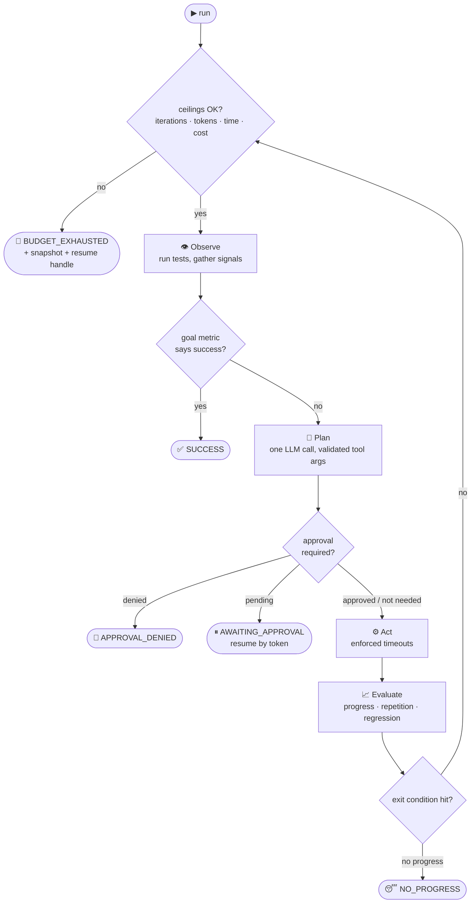
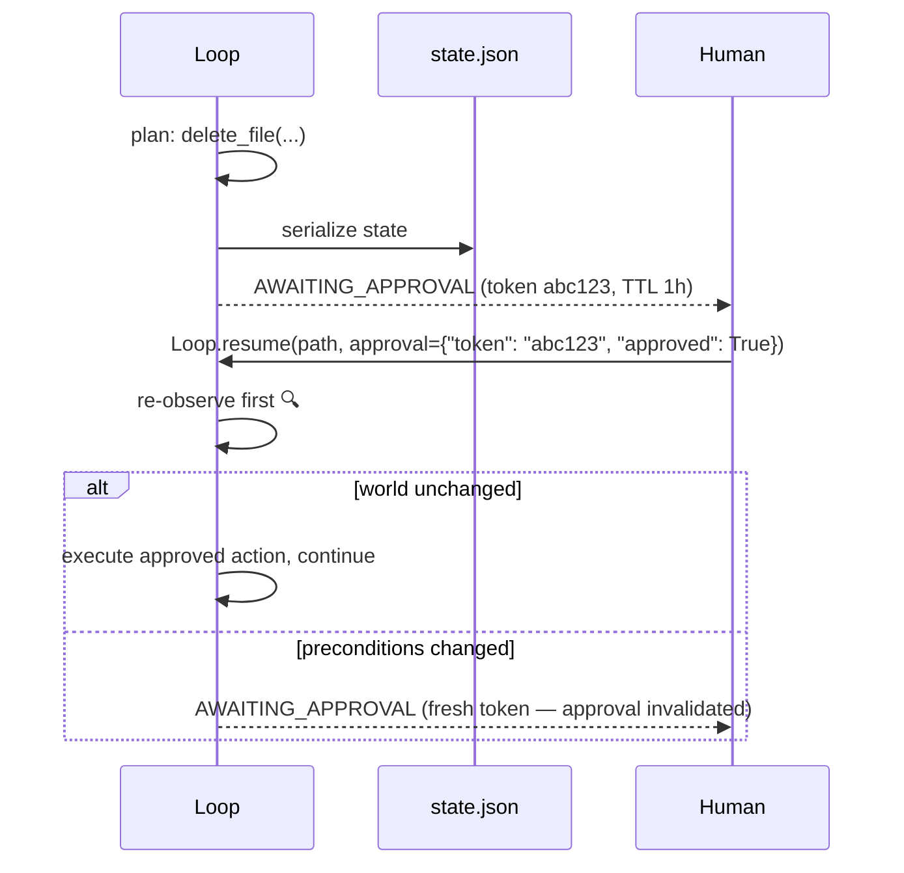
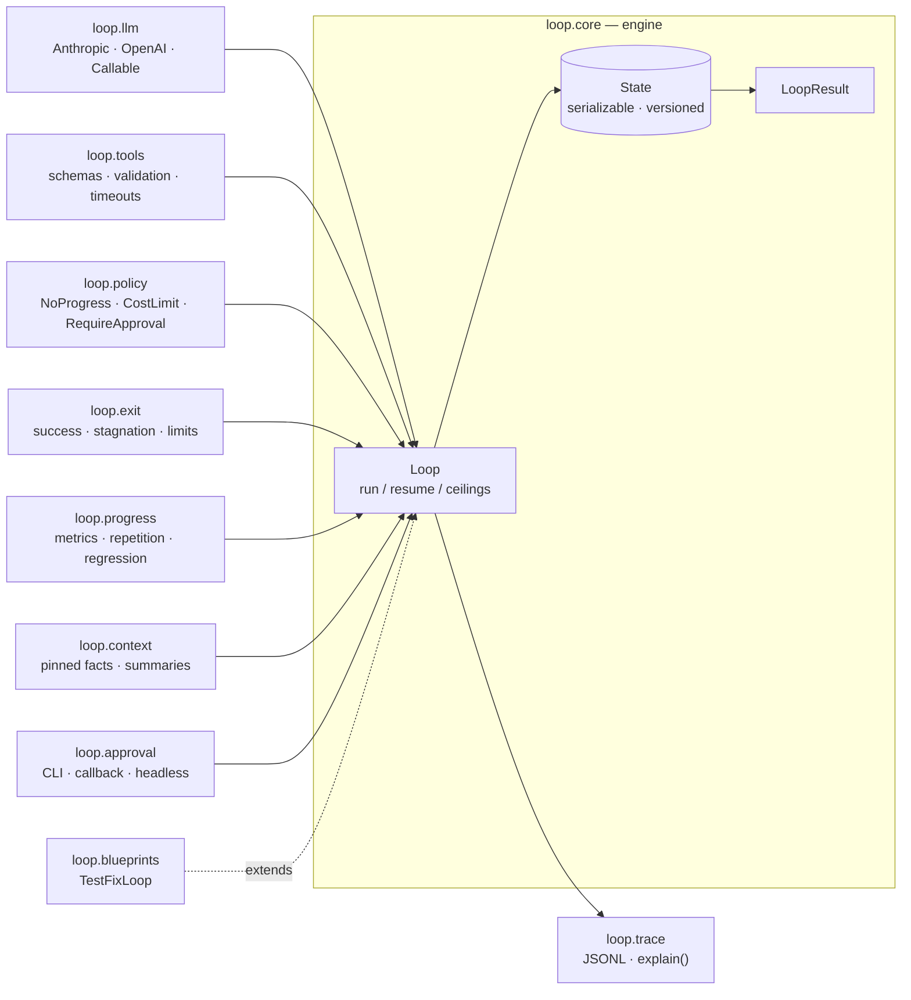

# 🔁 Loop

> **Production-grade loops for AI agents.** A structured runtime that makes agent loops reliable, observable, and governable — so you stop reinventing retry logic, exit conditions, budget caps, and approval gates for every agent you build.




---

## Table of Contents

- [Why Loop?](#why-loop)
- [How It Works](#how-it-works)
- [Installation](#installation)
- [Quickstart](#quickstart)
- [The Safety Model](#the-safety-model)
- [Every Result Is Actionable](#every-result-is-actionable)
- [Recipes](#recipes)
  - [1. Fix failing tests in a real repo](#1-fix-failing-tests-in-a-real-repo)
  - [2. Resume after running out of budget](#2-resume-after-running-out-of-budget)
  - [3. Human approval gates](#3-human-approval-gates)
  - [4. Headless approvals (CI, bots, services)](#4-headless-approvals-ci-bots-services)
  - [5. Bring your own LLM](#5-bring-your-own-llm)
  - [6. Define progress for your own task](#6-define-progress-for-your-own-task)
  - [7. Watch the loop live](#7-watch-the-loop-live)
- [Configuration Reference](#configuration-reference)
- [Writing Tools](#writing-tools)
- [Architecture](#architecture)
- [Development](#development)
- [Troubleshooting](#troubleshooting)
- [Roadmap](#roadmap)
- [FAQ](#faq)

---

## Why Loop?

Every team building agents eventually rewrites the same plumbing:

| You keep rebuilding…       | Loop gives you…                                                            |
| -------------------------- | -------------------------------------------------------------------------- |
| Retry / test-fix loops     | A structured **Observe → Plan → Act → Evaluate** engine                     |
| "Why won't it stop?"       | Declarative **exit conditions** + always-on iteration/token/time ceilings   |
| Surprise API bills         | **Token budgets** enforced *before* every action — calls can't overshoot    |
| Agents spinning in circles | A **progress engine** that detects stagnation, repetition, and regressions  |
| Context window overflow    | **Managed context**: pinned facts, failed-approach registry, summaries      |
| "Just ask a human first"   | **Approval gates** with CLI, callback, and pause/resume-by-token flows      |
| Debugging from print()     | **Live JSONL traces** + `loop.explain()` — "why did it stop?" always has an answer |

Loop is a **runtime layer, not a framework replacement** — it works with Anthropic, OpenAI, or any callable, and plugs into whatever stack you already have. It is *not* a model provider, vector DB, agent framework, or workflow engine.

## How It Works

Every loop runs the same auditable cycle. Hard ceilings are checked **before every action** — not just between iterations — so a loop can never overshoot its budget:



Everything the loop does is recorded as structured events, streamed live to JSONL and an optional callback. Nothing important hides inside prompts.

## Installation

Not yet published to PyPI (distribution name `tightloop`; import name is `loop`):

```bash
git clone <this-repo> && cd Loops
pip install -e .                  # core (pydantic only)
pip install -e ".[anthropic]"     # + Anthropic adapter
pip install -e ".[openai]"        # + OpenAI adapter
pip install -e ".[dev]"           # + pytest
```

**Requirements:** Python 3.10+. The only core dependency is `pydantic>=2.5`.

## Quickstart

```python
from loop import Loop, tool
from loop.llm.anthropic import AnthropicLLM  # or loop.llm.openai.OpenAILLM

@tool
def read_file(path: str) -> str:
    """Read a file."""
    return open(path).read()

@tool
def edit_file(path: str, content: str) -> str:
    """Overwrite a file."""
    open(path, "w").write(content)
    return f"wrote {path}"

loop = Loop(
    goal="Fix the failing tests",
    tools=[read_file, edit_file],
    llm=AnthropicLLM(),               # ANTHROPIC_API_KEY from env
)
result = loop.run()

print(result.status)                  # SUCCESS, BUDGET_EXHAUSTED, NO_PROGRESS, ...
print(result.recommended_action)      # every status tells you what to do next
print(loop.explain().render())        # full "why did it stop" report
```

When it starts, the loop **announces its effective limits** — safety is never silent:

```text
[loop] goal='Fix the failing tests' | limits: 20 iterations, 500,000 tokens, 1800s wall-clock
```

## The Safety Model

Three ceilings are **always on** — you cannot construct a loop without them:

| Ceiling          | Default        | What happens at the limit                                    |
| ---------------- | -------------- | ------------------------------------------------------------ |
| `max_iterations` | `20`           | `BUDGET_EXHAUSTED` + progress snapshot + resume handle        |
| `token_limit`    | `500,000`      | Same — and `max_tokens` is clamped so no call can overshoot   |
| `wall_clock_s`   | `1800` (30min) | Same                                                          |

Plus, optionally:

- `cost_limit_usd` — a USD ceiling derived from a pricing table that carries an **as-of date**. Tokens are authoritative; if the table is stale (>90 days) you choose the behavior: `warn` (default), `token-only`, or `refuse`.
- `NoProgress(window=3)` — on by default: stops after 3 consecutive iterations of repeated/invalid actions with zero metric movement.

Infinite loops are impossible by default. Mysterious stops don't exist: hitting any ceiling returns a **resumable snapshot**, never an exception in your face.

## Every Result Is Actionable

`LoopResult` always carries `resumable` and `recommended_action`:

| Status              | Resumable | What to do                                                       |
| ------------------- | :-------: | ---------------------------------------------------------------- |
| `SUCCESS`           |    —      | Done 🎉                                                           |
| `BUDGET_EXHAUSTED`  |    ✅     | Inspect snapshot → `Loop.resume(path, extend={...})`              |
| `NO_PROGRESS`       |    ✅     | Change tools/goal/limits, then resume                             |
| `PLAN_FAILED`       |    ✅     | Fix tool schemas or prompt, then resume                           |
| `APPROVAL_DENIED`   |    ✅     | Adjust plan or policy, then resume                                |
| `AWAITING_APPROVAL` |    ✅     | Approve via token, then resume                                    |
| `PENDING_EXPIRED`   |    ✅     | Resume to re-request approval                                     |
| `ERROR`             |  depends  | `loop.explain()` has the answer                                   |

## Recipes

### 1. Fix failing tests in a real repo

The flagship blueprint. Progress tracks **test identity, not counts** — if the agent fixes one test but breaks another, the trend flags `regressing` even though totals look flat:

```python
from loop import TestFixLoop
from loop.llm.anthropic import AnthropicLLM

result = TestFixLoop(
    llm=AnthropicLLM(),
    repo="path/to/repo",
    test_cmd="python -m pytest -q -rf --tb=short",
).run()
```

It ships with `run_tests` / `read_file` / `edit_file` tools (path-escape protected, stale-bytecode safe) and a pytest-aware goal metric.

### 2. Resume after running out of budget

```python
result = Loop(goal="...", tools=tools, llm=llm,
              token_limit=50_000, state_path="loop_state.json").run()

if result.status == "BUDGET_EXHAUSTED":
    print(result.reason)              # e.g. "token_limit (50,000) reached"
    result = Loop.resume(
        "loop_state.json", tools=tools, llm=llm,
        extend={"token_limit": 200_000},
    )
```

Resume is **deterministic**: context summaries and pinned facts are computed once, version-stamped, stored in state, and reused — never recomputed. If your tool schemas changed since the save, resume fails loudly (`SchemaChangedError`) unless you pass `allow_schema_change=True`.

### 3. Human approval gates

Gate any tool behind a human, with zero interrupt wiring:

```python
from loop import Loop, RequireApproval, CallbackApprovalRunner

loop = Loop(
    goal="Clean up the repo",
    tools=[delete_file, edit_file],
    llm=llm,
    policies=[RequireApproval({"delete_file"})],          # or a callable matcher
    approval_runner=CallbackApprovalRunner(notify_slack), # 60s timeout, deny-on-exception
)
```

The callback receives a **frozen, read-only** `ApprovalRequest` (action, args, reason — never your full context). If it throws or times out, the answer is *deny*. Every approval decision is traced.

### 4. Headless approvals (CI, bots, services)



```python
from loop import HeadlessApprovalRunner

result = loop.run()                       # → AWAITING_APPROVAL, result.approval_token
# ... later, from anywhere:
result = Loop.resume("loop_state.json", tools=tools, llm=llm,
                     approval={"token": result.approval_token, "approved": True})
```

Approvals carry a TTL (default 1 h) and are bound to the action *and* the state of the world. If the situation changed while the approval sat in someone's queue, it's invalidated and re-requested — you never approve yesterday's plan.

### 5. Bring your own LLM

Anything that returns an `LLMResponse` works — raw APIs, local models, test fakes:

```python
from loop import CallableLLM, LLMResponse, ToolCallReq

def my_model(messages, tool_schemas) -> LLMResponse:
    out = my_inference_stack(messages, tool_schemas)
    return LLMResponse(text=out.text,
                       tool_calls=[ToolCallReq(name=c.name, args=c.args) for c in out.calls],
                       input_tokens=out.in_tok, output_tokens=out.out_tok)

loop = Loop(goal="...", tools=tools, llm=CallableLLM(my_model))
```

Provider quirks are normalized at the adapter boundary: hallucinated or malformed tool calls are validated against schemas and fed back to the model as structured errors (retry budget: 2). Three strikes ends the iteration as `PLAN_INVALID`; two such iterations in a row exits `PLAN_FAILED`. Nothing is ever silently dropped.

### 6. Define progress for your own task

```python
from loop import GoalMetric, MetricSnapshot

class OpenTicketsMetric(GoalMetric):
    def measure(self, observation: str, state) -> MetricSnapshot:
        open_ids = parse_ticket_ids(observation)
        return MetricSnapshot(value=-float(len(open_ids)),
                              detail={"open": sorted(open_ids)})

    def is_success(self, snapshot) -> bool:
        return not snapshot.detail["open"]

loop = Loop(goal="Close all open tickets", tools=tools, llm=llm,
            observe=lambda state: ticket_system.report(),
            goal_metric=OpenTicketsMetric())
```

### 7. Watch the loop live

```python
loop = Loop(goal="...", tools=tools, llm=llm,
            trace_path="trace.jsonl",                    # live-appended JSONL
            on_event=lambda e: print(e["kind"], e))      # or push to your dashboard

loop.budget_report()    # itemized token accounting: pinned / summaries / verbatim / spent
loop.explain().render() # markdown: status, reason, signals, full decision chain
```

```bash
tail -f trace.jsonl | jq .kind
# "loop.start" "iteration.start" "llm.call" "action.executed" "iteration.end" "loop.end"
```

## Configuration Reference

`Loop(...)` constructor — everything is optional except `goal`, `tools`, `llm`:

| Parameter             | Default          | What it does                                                       |
| --------------------- | ---------------- | ------------------------------------------------------------------ |
| `goal`                | *(required)*     | What the loop is trying to achieve (pinned into every prompt)       |
| `tools`               | *(required)*     | List of `@tool` functions / `Tool` objects                          |
| `llm`                 | *(required)*     | `AnthropicLLM()`, `OpenAILLM()`, or any `CallableLLM`               |
| `observe`             | `None`           | `fn(state) -> str` run at the top of each iteration                 |
| `goal_metric`         | `None`           | `GoalMetric` — enables success detection + progress trends          |
| `policies`            | `[NoProgress(3)]`| `NoProgress`, `CostLimit`, `RequireApproval`, or your own           |
| `exits`               | `[]`             | Extra `Exit.success(...)`, `Exit.stagnation(...)`, etc.             |
| `max_iterations`      | `20`             | Always-on ceiling                                                   |
| `token_limit`         | `500_000`        | Always-on ceiling; clamps per-call `max_tokens`                     |
| `wall_clock_s`        | `1800`           | Always-on ceiling                                                   |
| `cost_limit_usd`      | `None`           | Optional USD ceiling (tokens stay authoritative)                    |
| `pricing_staleness`   | `"warn"`         | `warn` / `token-only` / `refuse` when the pricing table is old      |
| `approval_runner`     | `CLIApprovalRunner()` | Or `CallbackApprovalRunner(fn)` / `HeadlessApprovalRunner()`   |
| `summarizer`          | `None`           | Cheaper LLM for history compression (deterministic fallback if unset) |
| `verbatim_window`     | `3`              | Last K iterations kept verbatim in context                          |
| `max_tokens_per_call` | `4096`           | Per-LLM-call output cap (clamped to remaining budget)               |
| `state_path`          | `None`           | Where to persist state (required for headless approvals)            |
| `trace_path`          | `None`           | Live JSONL event log                                                |
| `on_event`            | `None`           | Callback for every trace event                                      |
| `quiet`               | `False`          | Suppress the startup limits announcement                            |

Methods: `loop.run()` · `Loop.resume(path, tools=, llm=, approval=, extend=, ...)` · `loop.explain()` · `loop.budget_report()`

## Writing Tools

Tools are plain Python functions. Schemas come from type hints and are **frozen for the loop's lifetime**:

```python
from loop import tool, run_command

@tool(timeout_s=30)                       # enforced — result becomes "aborted" on breach
def lint(path: str, fix: bool = False) -> str:
    """Run the linter on a file."""
    res = run_command(["ruff", "check", path] + (["--fix"] if fix else []), timeout_s=25)
    return res.stdout
```

| Supported parameter types | Unsupported (fails **at registration**, never silently) |
| ------------------------- | -------------------------------------------------------- |
| `str` `int` `float` `bool` `list` `dict` `Optional[...]` `Literal[...]` `Enum` pydantic models | `Callable`, file handles, arbitrary classes, missing hints, `*args/**kwargs` |

Two execution modes:

- **Thread runner** (default): timeout marks the result `aborted` — Python threads can't be force-killed, so prefer the next option for anything long or untrusted.
- **`run_command(cmd, timeout_s=, cwd=)`**: subprocess with **SIGTERM → SIGKILL escalation**. Use this inside tools that shell out.

One rule: **no nested loops.** Calling `Loop.run()` inside a tool raises `NestedLoopError` — delegate sub-tasks via a tool that returns a result instead.

## Architecture



```text
src/loop/
├── core/        # engine.py (run/resume/ceilings/approvals), state.py, result.py
├── llm/         # LLMClient protocol, CallableLLM, anthropic.py, openai.py
├── tools/       # @tool, schema derivation, validation, run_command
├── policy/      # NoProgress, CostLimit, RequireApproval
├── exit/        # Exit.success / max_iterations / token_limit / stagnation
├── progress/    # GoalMetric, repetition fingerprints, regression detection
├── context/     # pinned facts, failed-approaches registry, stored summaries
├── approval/    # frozen ApprovalRequest, CLI/callback/headless runners
├── trace/       # TraceSink (live JSONL), explain()
├── blueprints/  # TestFixLoop + PytestFailureMetric
└── pricing.py   # dated pricing table, staleness policy
```

## Development

```bash
python3 -m venv .venv && source .venv/bin/activate
pip install -e ".[dev]"
pytest -q          # 23 tests, < 1s
```

The suite covers the design's release gates: budget preemption, deterministic resume, validation three-strikes, no-progress detection, the nested-loop guard, tool timeouts, frozen approvals, TTL expiry, stale-precondition invalidation, schema-change detection, pricing staleness — plus an end-to-end `TestFixLoop` fixing a real failing pytest suite.

## Troubleshooting

| Symptom | Cause & fix |
| ------- | ----------- |
| `SchemaChangedError` on resume | Your tools changed since the state was saved. Intentional? → `allow_schema_change=True` |
| `ArtifactDriftError` on resume | Stored summaries were made by a different engine/summarizer version → `allow_artifact_drift=True` to reuse anyway |
| `LoopConfigError: headless approval requires state_path` | `HeadlessApprovalRunner` must serialize state to pause — pass `state_path="..."` |
| `UnsupportedTypeError` at startup | A tool parameter uses an unsupported hint — see the [type matrix](#writing-tools). This is deliberate: it fails at registration, never mid-run |
| Pricing staleness warning | The USD table is >90 days old. Tokens remain authoritative; choose `pricing_staleness="token-only"` or `"refuse"` to change behavior |
| Loop exits `NO_PROGRESS` "too early" | Read `loop.explain()` — it shows the repetition flags and flat-metric streak. Widen with `policies=[NoProgress(window=5)]` |
| Tool hangs past its timeout | Thread-runner results go `aborted` but the thread lingers (Python can't kill threads). Shell out via `run_command` — it SIGTERM→SIGKILLs |
| `NestedLoopError` | A tool tried to start a loop. Replace the inner loop with a tool that returns a result |
| Edits seem ignored when re-running Python tests | Stale `__pycache__` bytecode. `TestFixLoop.edit_file` already invalidates it; custom edit tools should too |

## Roadmap

- **v1.1 (committed):** async engine · OpenTelemetry exporter (firm requirement) · Refactor / PR-review / Bug-repro blueprints · webhook approvals
- **Naming:** ships as `tightloop` on PyPI with `import loop` for ergonomics. Note: PyPI's unrelated `loop` package also installs a `loop` module — don't install both in one environment

## FAQ

**Is this an agent framework?** No. Loop is the *runtime layer* for the loop itself — it composes with whatever does your prompting, retrieval, and orchestration.

**Why did my loop stop?** `loop.explain().render()`. That question always having an answer is the core design goal.

**Can the LLM rate its own progress?** It can annotate the trace, but LLM self-assessment **cannot trigger exits** in v1 — exits rely on hard signals (metrics, repetition, budgets) by design.

**What stops a runaway loop?** Three always-on ceilings, per-action budget checks, `max_tokens` clamping, and default no-progress detection. The quickstart announces all of them at start.
